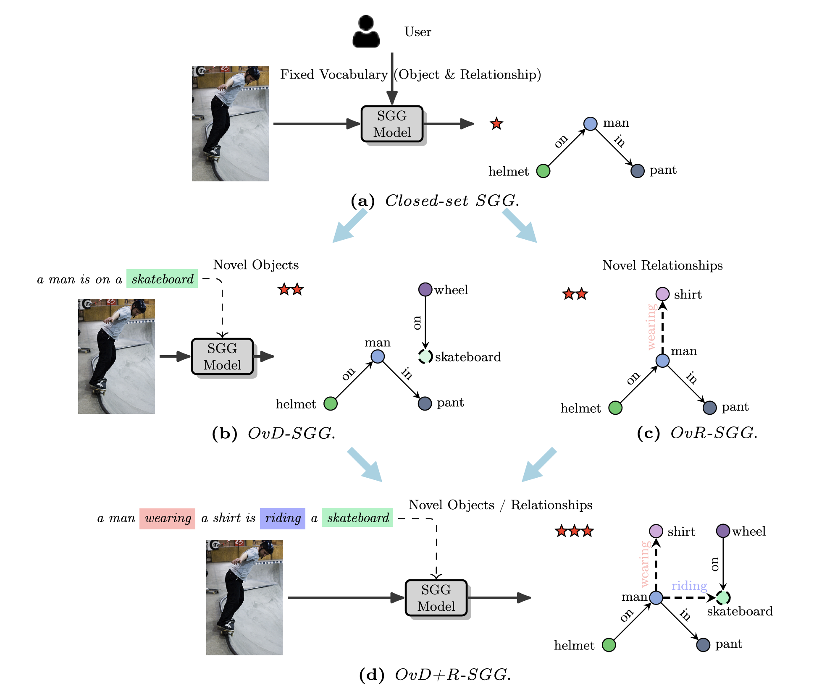
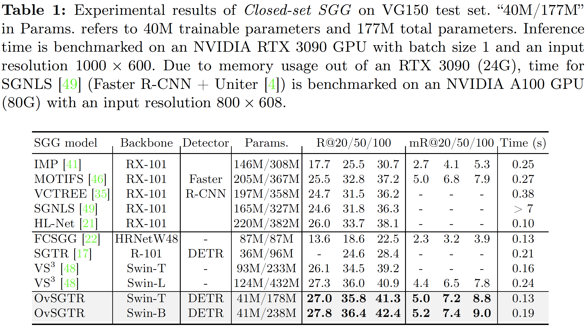

# Expanding Scene Graph Boundaries: Fully Open-vocabulary Scene Graph Generation via Visual-Concept Alignment and Retention
Official Implementation of "Expanding Scene Graph Boundaries: Fully Open-vocabulary Scene Graph Generation via Visual-Concept Alignment and Retention" (
    [Paper](https://arxiv.org/pdf/2311.10988)
)



## Setup
For simplicity, you can directly run ```bash install.sh```, which includes the following steps: 

0. install pytorch 1.9.1 and other dependencies, e.g., 
```
pip install torch==1.9.1+cu111 torchvision==0.10.1+cu111 torchaudio==0.9.1 -f https://download.pytorch.org/whl/torch_stable.html # this might need to be changed due to cuda driver version 

pip install -r requirements.txt
```

1. install GroundingDINO and download pre-trained weights
```
cd GroundingDINO && python3 setup.py install 
```
```
mkdir $PWD/GroundingDINO/weights/

wget https://github.com/IDEA-Research/GroundingDINO/releases/download/v0.1.0-alpha/groundingdino_swint_ogc.pth -O $PWD/GroundingDINO/weights/groundingdino_swint_ogc.pth

wget https://github.com/IDEA-Research/GroundingDINO/releases/download/v0.1.0-alpha2/groundingdino_swinb_cogcoor.pth -O $PWD/GroundingDINO/weights/groundingdino_swinb_cogcoor.pth
```


## Dataset 
```
- VG150
- COCO
```
prepare the dataset under the folder ```data``` with the [instruction](datasets/data.md)


## Closed-set SGG
For training OvSGTR (w. Swin-T) on VG150, running with this command 
```
bash scripts/DINO_train_dist.sh vg ./config/GroundingDINO_SwinT_OGC_full.py  ./data  ./logs/ovsgtr_vg_swint_full ./GroundingDINO/weights/groundingdino_swint_ogc.pth
```
or 
```
bash scripts/DINO_train_dist.sh vg ./config/GroundingDINO_SwinB_full.py  ./data  ./logs/ovsgtr_vg_swinb_full ./GroundingDINO/weights/groundingdino_swinb_cogcoor.pth 
```
for using Swin-B backbone.
you might need to change the default devices of ```CUDA_VISIBLE_DEVICES=0,1,2,3,4,5,6,7```  in the script. 
Notice that the actual batch size = batch size (default 4 in config files) * num gpus. 
For inference, running with this command
```
bash scripts/DINO_eval.sh vg [config file] [data path] [output path] [checkpoint]
```
or 
```
bash scripts/DINO_eval_dist.sh vg [config file] [data path] [output path] [checkpoint]
```
with multiple GPUs (there is a slight difference of the result output by DINO_eval.sh and DINO_eval_dist.sh due to data dividing and gathering). 



### Checkpoints
<!-- insert a table -->
<table>
  <thead>
    <tr style="text-align: right;">
      <th>backbone</th>
      <th>R@20/50/100</th>
      <th>Checkpoint</th>
      <th>Config</th>
    </tr>
  </thead>
  <tbody>
    <tr>
      <td>Swin-T</td>
      <td> 26.97 / 35.82 / 41.38 </td>
      <td><a href="https://huggingface.co/JosephZ/OvSGTR/blob/main/vg-swint-full.pth">link</a></td>
      <td>config/GroundingDINO_SwinT_OGC_full.py</td>
    </tr>
    <tr>
      <td>Swin-B</td>
      <td> 27.75 / 36.44 / 42.35 </td>
      <td><a href="https://huggingface.co/JosephZ/OvSGTR/blob/main/vg-swinb-full.pth">link</a>
      <td>config/GroundingDINO_SwinB_full.py </td>
    </tr>
    <tr>
      <td>Swin-B (w.o. frequency bias, focal loss)</td>
      <td> 27.53 / 36.18 / 41.79  </td>
      <td><a href="https://huggingface.co/JosephZ/OvSGTR/blob/main/vg-swinb-full-open.pth">link</a>
      <td>config/GroundingDINO_SwinB_full_open.py </td>
    </tr>
  </tbody>
</table> 

## OvD-SGG 
for OvD-SGG mode, set ```sg_ovd_mode = True``` in the config file (e.g., config/GroundingDINO_SwinT_OGC_ovd.py). 
Following "Towards Open-vocabulary Scene Graph Generation with Prompt-based Finetuning" and [VS3](https://github.com/zyong812/VS3_CVPR23), we split the VG150 into two parts, i.e., 
base objects ```VG150_BASE_OBJ_CATEGORIES```, and novel objects in ```VG150_NOVEL2BASE```.
For PREDCLS, please set ```use_gt_box=True``` when calling inference scripts. 


### Checkpoints
<!-- insert a table -->
<table>
  <thead>
    <tr style="text-align: right;">
      <th>backbone</th>
      <th>R@20/50/100 (Base+Novel)</th>
      <th>R@20/50/100 (Novel)</th>
      <th>Checkpoint</th>
      <th>Config</th>
    </tr>
  </thead>
  <tbody>
    <tr>
      <td>Swin-T</td>
      <td> 12.34 / 18.14 / 23.20 </td>
      <td> 6.90 / 12.06 / 16.49 </td>
      <td><a href="https://huggingface.co/JosephZ/OvSGTR/blob/main/vg-ovd-swint.pth">link</a></td>
      <td>config/GroundingDINO_SwinT_OGC_ovd.py</td>
    </tr>
    <tr>
      <td>Swin-B</td>
      <td>  15.43 / 21.35 / 26.22 </td>
      <td>  10.21 / 15.58 / 19.96 </td>
      <td><a href="https://huggingface.co/JosephZ/OvSGTR/blob/main/vg-ovd-swinb.pth">link</a>
      <td>config/GroundingDINO_SwinB_ovd.py</td>
    </tr>
  </tbody>
</table> 

## OvR-SGG
for OvR-SGG mode, set ```sg_ovr_mode = True``` in the config file (e.g., config/GroundingDINO_SwinT_OGC_ovr.py). 
Base object categories ```VG150_BASE_PREDICATE``` and novel object categories ```VG150_NOVEL_PREDICATE``` can be found in the ```datasets/vg.py```.

### Checkpoints
<!-- insert a table -->
<table>
  <thead>
    <tr style="text-align: right;">
      <th>backbone</th>
      <th>R@20/50/100 (Base+Novel)</th>
      <th>R@20/50/100 (Novel)</th>
      <th>Checkpoint</th>
      <th>Config</th>
      <th>Pre-trained checkpoint </th>
      <th>Pre-trained config </th>
    </tr>
  </thead>
  <tbody>
    <tr>
      <td>Swin-T</td>
      <td>  15.85 / 20.50 / 23.90 </td>
      <td>  10.17 / 13.47 / 16.20 </td> 
      <td><a href="https://huggingface.co/JosephZ/OvSGTR/blob/main/vg-ovr-swint.pth">link</a></td>
      <td>config/GroundingDINO_SwinT_OGC_ovr.py</td>
      <td><a href="https://huggingface.co/JosephZ/OvSGTR/blob/main/vg-pretrain-coco-swint.pth"><s>link</s></a></td>
      <td>config/GroundingDINO_SwinT_OGC_pretrain.py</td> 
    </tr>
    <tr>
      <td>Swin-B</td>
      <td>  17.63 / 22.90 / 26.68  </td>
      <td>  12.09 / 16.37 / 19.73  </td>
      <td><a href="https://huggingface.co/JosephZ/OvSGTR/blob/main/vg-ovr-swinb.pth">link</a>
      <td>config/GroundingDINO_SwinB_ovr.py</td>
      <td><a href="https://huggingface.co/JosephZ/OvSGTR/blob/main/vg-pretrain-coco-swinb.pth">link</a>
      <td>config/GroundingDINO_SwinB_pretrain.py</td>
    </tr>
  </tbody>
</table> 


## OvD+R-SGG
For OvD+R-SGG mode, set both ```sg_ovd_mode = True``` and ```sg_ovr_mode = True``` (e.g., config/GroundingDINO_SwinT_OGC_ovdr.py)
### Checkpoints
<!-- insert a table -->
<table>
  <thead>
    <tr style="text-align: right;">
      <th>backbone</th>
      <th>R@20/50/100 (Joint)</th>
      <th>R@20/50/100 (Novel Object)</th>
      <th>R@20/50/100 (Novel Relation)</th>
      <th>Checkpoint</th>
      <th>Config</th>
      <th>Pre-trained checkpoint </th>
      <th>Pre-trained config </th>
    </tr>
  </thead>
  <tbody>
    <tr>
      <td>Swin-T</td>
      <td> 10.02 / 13.50 / 16.37  </td>
      <td> 10.56 / 14.32 / 17.48  </td>
      <td>  7.09 / 9.19 / 11.18 </td>
      <td><a href="https://huggingface.co/JosephZ/OvSGTR/blob/main/vg-ovdr-swint.pth">link</a></td>
      <td>config/GroundingDINO_SwinT_OGC_ovdr.py</td>
      <td><a href="https://huggingface.co/JosephZ/OvSGTR/blob/main/vg-pretrain-coco-swint.pth"><s>link</s></a></td>
      <td>config/GroundingDINO_SwinT_OGC_pretrain.py</td> 
    </tr>
    <tr>
      <td>Swin-B</td>
      <td> 12.37 / 17.14 / 21.03  </td>
      <td> 12.63 / 17.58 / 21.70  </td>
      <td> 10.56 / 14.62 / 18.22  </td>
      <td><a href="https://huggingface.co/JosephZ/OvSGTR/blob/main/vg-ovdr-swinb.pth">link</a>
      <td>config/GroundingDINO_SwinB_ovdr.py</td>
      <td><a href="https://huggingface.co/JosephZ/OvSGTR/blob/main/vg-pretrain-coco-swinb.pth">link</a>
      <td>config/GroundingDINO_SwinB_pretrain.py</td>
    </tr>
  </tbody>
</table> 


## Acknowledgement
Thank [Scene-Graph-Benchmark.pytorch](https://github.com/KaihuaTang/Scene-Graph-Benchmark.pytorch) and [GroundingDINO](https://github.com/IDEA-Research/GroundingDINO) for their awesome code and models. 


## Citation
Please cite OvSGTR in your publications if it helps your research:
```
@inproceedings{chen2024expanding,
  title={Expanding Scene Graph Boundaries: Fully Open-vocabulary Scene Graph Generation via Visual-Concept Alignment and Retention},
  author={Chen, Zuyao and Wu, Jinlin and Lei, Zhen and Zhang, Zhaoxiang and Chen, Changwen},
  booktitle={European Conference on Computer Vision (ECCV)},
  pages={108--124},
  year={2024}
}
```
